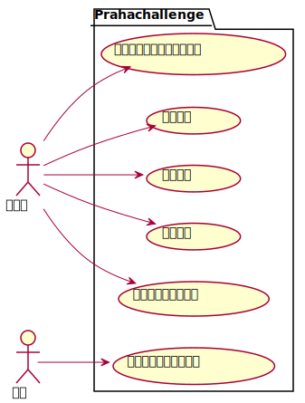

# プラハチャレンジをDDDで実装してみる

大きくなりそうだったので、 [sushidesu/prahachallenge](https://github.com/sushidesu/prahachallenge) から切り出しました。

## TODO

- [ ] 参加者
  - [ ] 一覧の取得
    - [ ] 取得
    - [ ] 課題によるフィルタリング
    - [ ] 課題の進捗ステータスによるフィルタリング
    - [ ] ページング
  - [ ] 新規追加
  - [ ] 更新
  - [ ] 削除
- [ ] ペア
  - [x] 一覧の取得
  - [ ] 更新
- [ ] チーム
  - [ ] 一覧の取得
  - [ ] 更新
- [ ] 課題
  - [ ] 新規追加
  - [ ] 更新
  - [ ] 削除

## ユースケース図



<details><summary>コード</summary>

```plantuml
left to right direction

actor 参加者 as participant

actor ペア as pair

' actor チーム as team

package Prahachallenge {
  usecase "進捗ステータスを変更する" as change_task_status
  usecase "退会する" as leave
  usecase "入会する" as enter
  usecase "休会する" as recess
  usecase "他のペアに移動する" as move_pair

  usecase "他のチームに移動する" as move_team
}

participant --> change_task_status
participant --> leave
participant --> enter
participant --> recess
participant --> move_pair

pair --> move_team
```
</details>

## モデル図



<details><summary>コード</summary>

```plantuml

entity 参加者の移動 {
  参加者の移動を行うドメインサービス
}
note bottom
・ペアの人数が4名以上になる場合、2人のペアを2つに分解する
・ペアの人数が1名以下になる場合、他のペアに参加者を移動する
・チームの人数が2名以下になる場合、他のチームに参加者を移動する
・復帰者は最も参加者の少ないチームの
最も参加者の少ないペアに所属する
end note

rectangle チーム集約 {
  entity Team {
    id
    ---
    名前
  }
  note right of Team
  ・名前は3桁以内の数字のみ
  ・参加者は最低3名必要
  end note
}

rectangle ペア集約 {
  entity Pair {
    id
    ---
    名前
    チームid
  }
  note right of Pair
  ・名前は英小文字1文字
  ・参加者は2〜3名のみ
  end note
}

rectangle 参加者集約 {
  entity Participant {
    id
    ---
    名前
    メールアドレス
    在籍ステータス
    ペアid
  }
  note right of Participant
  ・在籍ステータスは
  「在籍中/休会中/退会済み」の3種類
  ・「在籍中」からはじまる
  end note
}

rectangle 課題集約 {
  entity Task {
    id
    ---
    課題名
    進捗ステータス
    所有者id
  }
  note right of Task
  ・進捗ステータスは
  「未着手/レビュー待ち/完了」の3種類
  ・進捗スタータスは所有者のみ変更可能
  ・「完了」ステータスは変更できない
  end note
}

Team "1" <-- "0..n" Pair
Pair "1" <-- "0..n" Participant
Participant "1" <- "0..n" Task
```
</details>

## 備考

- チーム-ペア-参加者を集約にまとめると集約が大きくなりすぎてしまうと思い、分けることにした
- そのため、参加者の移動はドメインサービスで行うのが良さそうだと考えた
  - しかしこの場合、`参加者の移動`の責務が大きすぎる？
